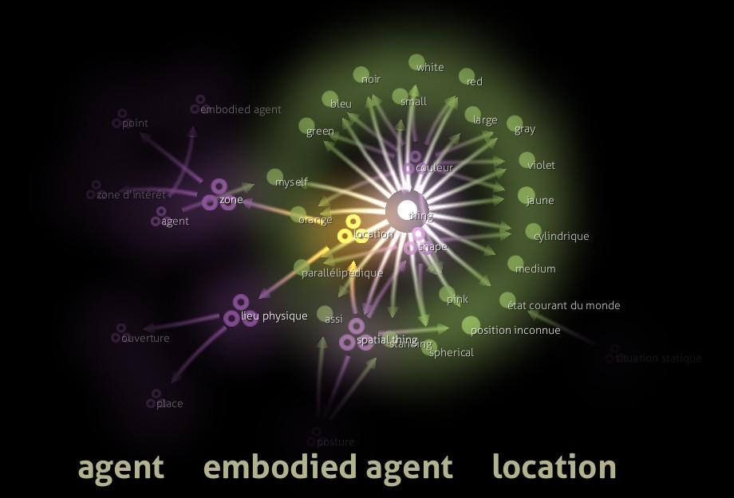

oro-view
========

`oro-view` is an OpenGL-based viewer for semantic networks.



`oro-view` requires a KB-API compliant ontology server like
[oro-server](https://github.com/severin-lemaignan/oro-server) or
[minimalkb](https://github.com/severin-lemaignan/minimalkb) (Python-based,
preferred) to fetch the concepts and their relationships.

The graph can be zoomed/panned with the mouse.

It features a special, shiny, "Active Concept" focus method:
if a concept is asserted to belong to the `ActiveConcept` class,
then it pops on the screen, as a bright, warm, yellow spot.

The code is originally based on Gource, by Andrew Caudwell.

Installation
------------

`oro-view` depends on [liboro](https://github.com/severin-lemaignan/liboro) to connect to the server. You need to install it first.

It also depends on `SDL`, `jsoncpp`, `FTGL` and `boost`.

On debian/Ubuntu:
```
$ sudo apt-get install libsdl1.2-dev libjsoncpp-dev libftgl-dev libboost-dev
```

Then, it is a regular `CMake` workflow:
```
$ cd oro-view
$ mkdir build && cd build
$ cmake ..
$ make
```
(and optionally `sudo make install`)

Documentation
-------------

Sorry, not much for now...

```
oro-view --help
```

